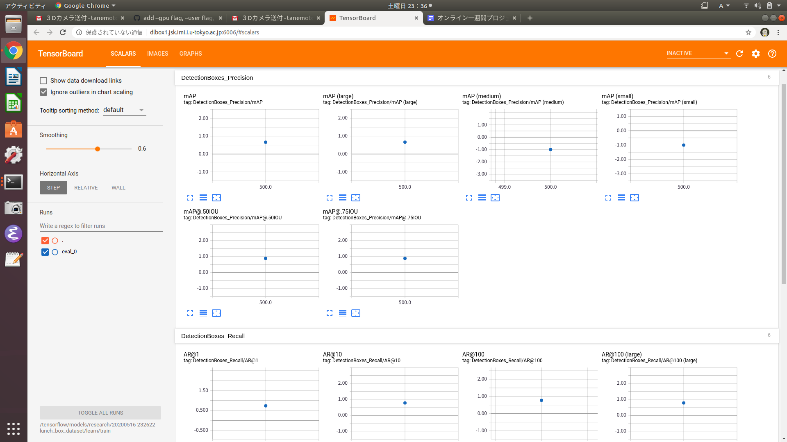

# お弁当盛り付けロボット
## HIROを動かす

[add_by_tanemotoブランチのコミット参照](https://github.com/MiyabiTane/rtmros_tutorials/tree/add_by_tanemoto)

## jsk_model_toolsを使う

[add_by_tanemoブランチのコミット参照](https://github.com/MiyabiTane/jsk_model_tools/tree/add_by_tanemoto)

## Coral TPU を使う
### gazebo内で使う

hironxjskのgazeboを立ち上げる。例えば
```
source ~/ros/jsk_hiro_ws/devel/setup.bash
roslaunch hironx_tutorial hiro_lunch_box.launch 
```

Coralの認識ノードを立ち上げる
```
source ~/coral_ws/devel/setup.bash
roslaunch coral_usb edgetpu_object_detector.launch INPUT_IMAGE:=/head_camera/rgb/image_raw
```

結果を見てみる

```
rosrun image_view image_view image:=/edgetpu_object_detector/output/image
```

閾値の調節
```
 rosrun rqt_reconfigure rqt_reconfigure
```

## Coralに新しいモデルを学習させる<br>

### [アノテーションしてデータセットを作る](https://github.com/MiyabiTane/HIRO_LunchBox/tree/master/labelme)<br>

### Coral用に学習する<br>

voc変換の結果を使って以下のようなデータセットをつくる。
```
lunch_box_dataset
|-- train  # train dataset
|   |-- JPEGImages
|   |-- SegmentationClass
|   |-- SegmentationClassPNG
|   |-- SegmentationClassVisualization
|   |-- SegmentationObject
|   |-- SegmentationObjectPNG
|   |-- SegmentationObjectVisualization
|   `-- class_names.txt
`-- test   # test dataset
    |-- JPEGImages
    |-- SegmentationClass
    |-- SegmentationClassPNG
    |-- SegmentationClassVisualization
    |-- SegmentationObject
    |-- SegmentationObjectPNG
    |-- SegmentationObjectVisualization
    `-- class_names.txt
```

学習は自分のPCではできないのでdlboxにアクセスして行う。<br>

ローカルから
```
scp -r lunch_box_dataset/ tanemoto@dlbox1.jsk.imi.i.u-tokyo.ac.jp:~/coral_learn
```
のようにしてデータとtrain_edgetpu_detection.shをdlboxに渡してから
```
ssh tanemoto@dlbox1.jsk.imi.i.u-tokyo.ac.jp
cd coral_learn
wget https://gist.githubusercontent.com/k-okada/bb65691bd58a6175b8f5f1c2a3c4caed/raw/0febe43740776051c2d4df6a11feaade9288320c/train_edgetpu_detection.sh
bash ./train_edgetpu_detection.sh ./lunch_box_dataset/
```
とすると20200514-171839-lunch_box_datasetのようなフォルダがホームディレクトリに生成されるので
```
scp -r tanemoto@dlbox1.jsk.imi.i.u-tokyo.ac.jp:~/20200514-171839-lunch_box_dataset .
```
のようにしてローカルに持ってくる。<br>

学習の引数を変えたい時は[ここ](https://github.com/k-okada/coral_usb_ros/blob/add_docker/docker/scripts/train.sh)を参照する。<br>


### 学習結果を見てみる
```
ssh dlbox1.jsk.imi.i.u-tokyo.ac.jp
bash ./run.sh 20200514-171839-lunch_box_dataset/ tensorboard
```
として、例えばポート番号が6006なら（デフォルト）、http://dlbox1.jsk.imi.i.u-tokyo.ac.jp:6006/ をローカルのブラウザで開く。mAP, mARが１に近いほど良いモデルである。また、imagesでテスト画像に対するboxの値を見ることができる。ただし、テスト画像にも偏りがあるということを忘れずに！<br>

<br>

できない時は以下を試してみる
```
wget https://raw.githubusercontent.com/k-okada/coral_usb_ros/add_docker/docker/run.sh -O run.sh
```

また、生成されたデータは権限がないと動かしたり消したりすることができない。
```
bash ./run.sh 20200514-171839-lunch_box_dataset/
```
とするとDockerの中に入ることができて、rm, mvなどの操作をすることができる。<br>


### 学習済みモデルを試してみる<br>

20200514-171839-lunch_box_dataset/learn/models/にあるoutput_tflite_graph_edgetpu.tflite、labels.txtを使う。launchファイル内で以下のようにしてパスを通す。（edgetpu_food_detector.launch参照）<br>
```
<arg name="model_file" default="$(find coral_usb)/models/output_tflite_graph_edgetpu.tflite"/>
<arg name="label_file" default="$(find coral_usb)/models/labels.txt"/>
```

## ＜参考＞Coral TPUのセットアップ<br>
### Coral TPUのインストール を行う

https://github.com/knorth55/coral_usb_ros#install-the-edge-tpu-runtime をみてCoral TPUをインストールする

```
echo "deb https://packages.cloud.google.com/apt coral-edgetpu-stable main" | sudo tee /etc/apt/sources.list.d/coral-edgetpu.list
curl https://packages.cloud.google.com/apt/doc/apt-key.gpg | sudo apt-key add -
sudo apt-get update
sudo apt-get install libedgetpu1-max
sudo apt-get install python3-edgetpu
```

### Tensorflowliteのインストール を行う

https://github.com/knorth55/coral_usb_ros#install-just-the-tensorflow-lite-interpreter をみてtensorflowlite interpreterをインストールする
```
sudo apt-get install python3-pip
wget https://dl.google.com/coral/python/tflite_runtime-1.14.0-cp36-cp36m-linux_x86_64.whl
pip3 install tflite_runtime-1.14.0-cp36-cp36m-linux_x86_64.whl
```

### ワークスペースをビルドする

https://github.com/knorth55/coral_usb_ros#workspace-build-melodic
をみてワークスペースを作成しコンパイルする

```
source /opt/ros/melodic/setup.bash
mkdir -p ~/coral_ws/src
cd ~/coral_ws/src
git clone https://github.com/knorth55/coral_usb_ros.git
wstool init
wstool merge coral_usb_ros/fc.rosinstall.melodic
wstool update
rosdep install --from-paths . --ignore-src -y -r
cd ~/coral_ws
catkin init
catkin config -DPYTHON_EXECUTABLE=/usr/bin/python3 -DPYTHON_INCLUDE_DIR=/usr/include/python3.6m -DPYTHON_LIBRARY=/usr/lib/x86_64-linux-gnu/libpython3.6m.so
catkin build -vi
````````````````

### 学習済みモデルをダウンロードする

https://github.com/knorth55/coral_usb_ros#model-download をみてモデルをダウンロードする

```
source /opt/ros/melodic/setup.bash
source ~/coral_ws/devel/setup.bash
roscd coral_usb/scripts
python download_models.py
`````

### Coral TPUを使うにあたっての事前準備

```
python3 -m pip install opencv-python
```

### USBカメラを立ち上げる

カメラノードを立ち上げる

```
source /opt/ros/melodic/setup.bash
roslaunch roseus_tutorials usb-camera.launch 
```

### Coralの認識ノードを立ち上げる

```
source /opt/ros/melodic/setup.bash
source ~/coral_ws/devel/setup.bash
roslaunch coral_usb edgetpu_object_detector.launch INPUT_IMAGE:=/image_raw

```

### 結果を見てみる

```
source /opt/ros/melodic/setup.bash
rosrun image_view image_view image:=/edgetpu_object_detector/output/image
```

### 閾値の調節

```
 rosrun rqt_reconfigure rqt_reconfigure
```

edgetpu_object_detectorのscore_threshで物体表示の閾値を変更することができる。

